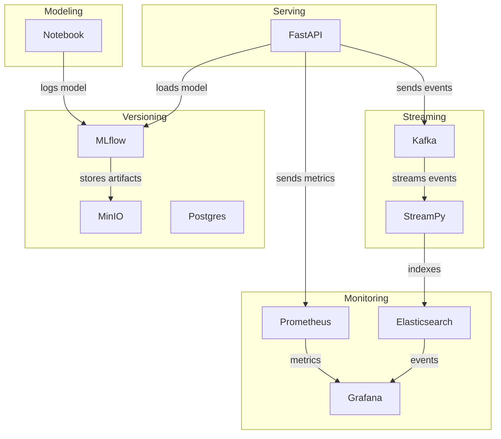

# Model Serving and Monitoring Platform

A full-stack, containerized machine learning platform for model training, versioning, serving, monitoring, and automated event streaming.  
This project demonstrates best practices for MLOps using Docker Compose, MLflow, MinIO, Prometheus, Grafana, Kafka, Elasticsearch, and FastAPI.

---

## ✨ Project Overview

- **Model Training & Versioning:** Train and log models with MLflow, storing artifacts in MinIO (S3-compatible).
- **Model Serving:** Serve predictions via a Fast API, with Prometheus metrics and Kafka event streaming.
- **Streaming & Monitoring:** Stream all prediction events to Kafka, persist in Elasticsearch, and visualize in Grafana.
- **Metrics & Retraining:** Monitor service and model metrics with Prometheus/Grafana; foundation for auto-retraining pipelines.

---

## 📋 Rules & Best Practices

- All services run in Docker containers and communicate on a shared network.
- All configuration and persistent data are stored in versioned folders and mounted as volumes.
- All sensitive/configurable values are managed via a `.env` file.

---

## 🏗️ High-Level Architecture



---

## 📂 Folder Structure

- `modeling/` — Model training, pipeline, and requirements
- `versioning/` — MLflow, MinIO, and database storage/config
- `serving/` — Fast API, Dockerfile, and model loading
- `communication/` — Kafka, Kafka Connect, streaming scripts
- `monitoring/` — Prometheus, Grafana, Elasticsearch configs/data
- `scripts/` — Utility scripts for testing and monitoring (see below)
- `docker-compose.yaml` — All services and network configuration

---

## 🚀 Quickstart

### 1. Clone and Configure

```bash
git clone <this-repo>
cd model-serving-and-monitoring
```

### 2. Build and Start All Services

```bash
docker-compose up --build
```

### 3. Create MinIO Bucket for MLflow

- Access MinIO Console: [http://localhost:9001](http://localhost:9001)
- Login with credentials from `.env`
- **Create a bucket named `mlflow`**

### 4. Train and Register a Model

- Open and run `modeling/classif.ipynb` (Jupyter or VSCode)
- Model and artifacts will be logged to MLflow and MinIO

### 5. Serve Predictions

- Start the serving API (already in Docker Compose)
- Send test requests:

```bash
bash scripts/calls.sh --repetitions=10
```

---

## 📊 Monitoring & Visualization

### Grafana

- Access: [http://localhost:3000](http://localhost:3000)
- **Default login:** `admin` / `admin` (or as set in `.env`)

#### Add Elasticsearch Data Source

1. Go to **Connections  > Add new connection**
2. Click  **Elasticsearch**
3. **URL:** `http://elasticsearch:9200`
4. **Authentication: No Authentication**
5. **Skip TSL certificate validation**
6. **Index name:** `predictions`
7. **Time field name:** `@timestamp`
8. **Save & Test**

#### Add Prometheus Data Source

1. Go to  **Connections  > Add new connection**
2. Click  **Prometheus**
3. **URL:** `http://prometheus:9090`
4. **Authentication: No Authentication**
5. **Skip TSL certificate validation**
6. **Save & Test**

#### Example Panel

Load the dashboard  

1. In Grafana, go to **Dashboards > Import**  
2. Click **Upload JSON file** and select: `monitoring/grafana/model_comparison_dashboard.json`  
3. When prompted, select your **Prometheus** and **Elasticsearch** data sources  
4. Click **Import** to load the dashboard

#### **What This Dashboard Shows**

- **Prediction counts** for both models (from Elasticsearch)
- **Prediction duration, CPU, and memory** for both models (from Prometheus)
- **Class distribution** for both models (from Elasticsearch)
- **Side-by-side performance and statistics** for production and shadow models

## 🛠️ Troubleshooting

- **Grafana Permission Error:**  
  
  ```bash
  sudo chmod -R 777 ./monitoring/grafana
  ```

- **Check Event Count in Elasticsearch:**  
  
  ```bash
  bash scripts/check_events.sh
  ```

- **Check if Events Were Sent to Elasticsearch:**
  
  The script `scripts/check_events.sh` checks whether there are any prediction events indexed in Elasticsearch. It queries the `predictions` index and prints the number of events found. This is useful for verifying that your pipeline is sending data to Elasticsearch correctly.
  
  Usage:
  
  ```bash
  bash scripts/check_events.sh
  ```

---

## 🔗 Useful Links

- [MLflow + MinIO Setup Guide](https://blog.min.io/setting-up-a-development-machine-with-mlflow-and-minio/)
- [Elasticsearch Docker Docs](https://www.elastic.co/guide/en/elasticsearch/reference/current/docker.html)
- [Prometheus Docs](https://prometheus.io/docs/introduction/overview/)
- [Grafana Docs](https://grafana.com/docs/grafana/latest/)

---

## 📜 License

This project is licensed under the MIT License.

---

## 📑 Scripts

The `scripts/` directory contains utility scripts for testing and monitoring:

- `calls.sh` — Bash script to send test prediction requests to the serving API. Supports random or user-specified input and measures response time.
- `check_events.sh` — Bash script to check if prediction events have been indexed in Elasticsearch. Useful for verifying the event pipeline.

Usage examples are provided in the relevant sections above.

---

## ✍️ Author & Contributions

- Matheus Villela Torres
- email: matheusvt@gmail.com

---